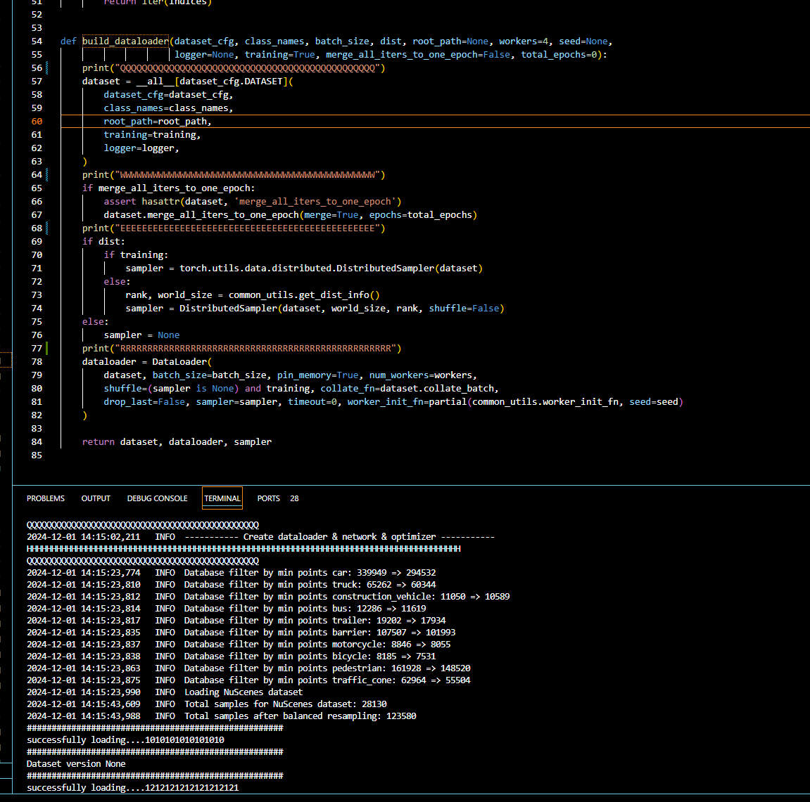
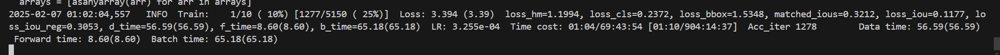
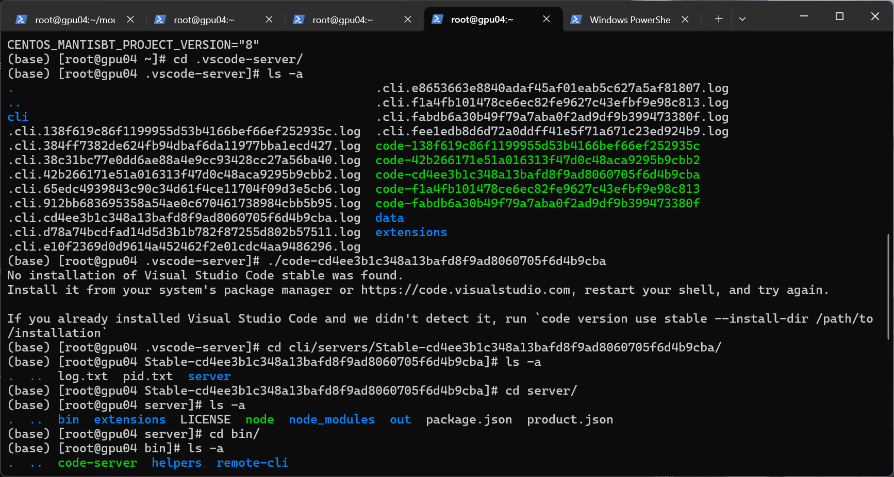
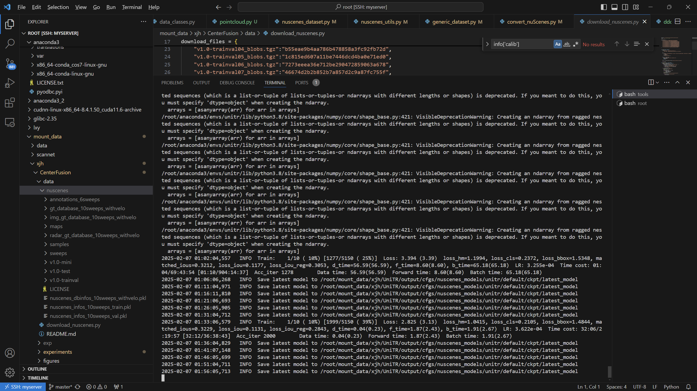
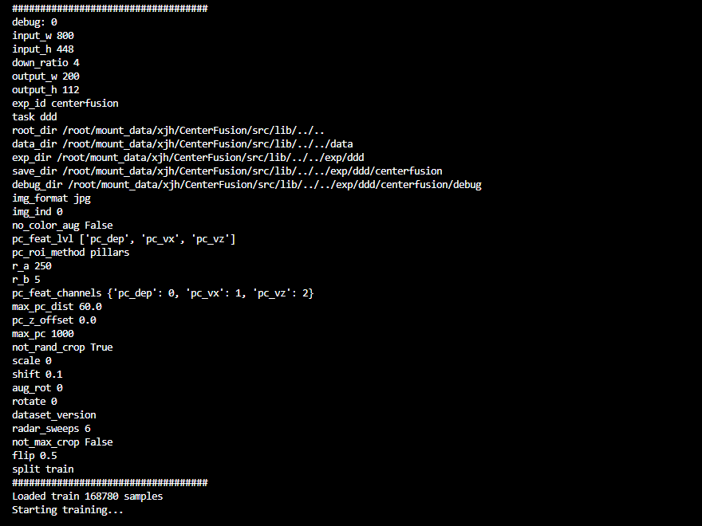

# PillarFusionMultimodal-Fusion-3D-Target-Detection-for-Autonomous-Driving
## 作者人生第一个大型的自动驾驶多模态融合仓库，能力有限，如有不足，还请原谅
## 代码仓库还在完善，完善结束后，会更新完整复现操作

<div align="center">
  
</div>


> 


## Introduction

<div align="center">
  
</div>

In this paper, we xxxxxxxxxxxxxxxxxxxxxxxxxxxxxxxxxxxxxxxxxxxxxxxxxxxxxxxxxxxxx
xxxxxxxxxxxxxxxxxxxxxxxxxxxxxxxxxxx
<div align="center">
  
</div>

## Main results
### 3D Object Detection (on NuScenes validation)
|  Model  | NDS | mAP |mATE | mASE | mAOE | mAVE| mAAE | ckpt | Log |
|---------|---------|--------|---------|---------|--------|---------|--------|--------|--------|


### Bev Map Segmentation (on NuScenes validation)
|  Model  | mIoU | Drivable |Ped.Cross.| Walkway |  StopLine  | Carpark |  Divider  |  ckpt | Log |
|---------|----------|--------|--------|--------|--------|---------|--------|---------|--------|


### What's new here?
#### 🔥 Beats previous SOTAs of outdoor multi-modal 3D Object Detection and BEV Segmentation

##### 3D Object Detection
<div align="left">
  
</div>

##### BEV Map Segmentation
<div align="left">
  
</div>

#### 🔥 Weight-Sharing among all modalities 
We introduce a modality-agnostic transformer encoder to handle these view-discrepant sensor data for parallel modal-wise representation learning and automatic cross-modal interaction without additional fusion steps.

#### 🔥 Prerequisite for 3D vision foundation models
A weight-shared unified multimodal encoder is a prerequisite for foundation models, especially in the context of 3D perception, unifying information from both images and LiDAR data. This is the first truly multimodal fusion backbone, seamlessly connecting to any 3D detection head.

## Quick Start
### Installation

```shell
conda create -n pillarfusion python=3.8
# Install torch, we only test it in pytorch 1.10
pip install torch==1.10.1+cu113 torchvision==0.11.2+cu113 -f https://download.pytorch.org/whl/torch_stable.html

or(if you are in CHINA，please install it by the following method)

pip install torch==1.10.1+cu113 torchvision==0.11.2+cu113 -f https://mirrors.aliyun.com/pytorch-wheels/cu113

git clone https://github.com/njuptlogic/Pillar_fusion.git
cd pillarfusion

# Install extra dependency
pip install -r requirements.txt

# Install nuscenes-devkit
pip install nuscenes-devkit==1.0.5

# Develop
python setup.py develop

# (File "/root/miniconda/envs/unitr/lib/python3.8/site-packages/kornia/geometry/conversions.py",line 556)
if you meet this problem,please try the method below
at the 556 line
# this slightly awkward construction of the output shape is to satisfy torchscript
    #已修改output_shape = [*list(quaternion.shape[:-1]), 3, 3]
    output_shape = (quaternion.size(0), 3, 3)  # Or use the known shape instead of inferring dynamically

    matrix = matrix_flat.reshape(output_shape)
    return matrix
```
### 参考依赖库如下（conda list结果）
You can check your env from [condalist.md](https://drive.google.com/file/d/1ZSDUnbZnMthaENyE6A-VCPRN2hEkx7Dh/view?usp=drive_link)

### Dataset Preparation

* Please download the official [NuScenes 3D object detection dataset](https://www.nuscenes.org/download) and organize the downloaded files as follows: 

Tips:here is the method to download the nuscenes dataset quickly without know much about nuscenes
```shell
cd Pillar_fusion
# the python script in the page can help you download
python download_nuscenes.py

```
```
OpenPCDet
├── data
│   ├── nuscenes
│   │   │── v1.0-trainval (or v1.0-mini if you use mini)
│   │   │   │── samples
│   │   │   │── sweeps
│   │   │   │── maps
│   │   │   │── v1.0-trainval  
├── pcdet
├── tools
```

- (optional) To install the Map expansion for bev map segmentation task, please download the files from [Map expansion](https://www.nuscenes.org/download) (Map expansion pack (v1.3)) and copy the files into your nuScenes maps folder, e.g. `/data/nuscenes/v1.0-trainval/maps` as follows:
```
OpenPCDet
├── maps
│   ├── ......
│   ├── boston-seaport.json
│   ├── singapore-onenorth.json
│   ├── singapore-queenstown.json
│   ├── singapore-hollandvillage.json
```

* Generate the data infos by running the following command (it may take several hours): 

```python 
# Create dataset info file, lidar and image gt database
python -m pcdet.datasets.nuscenes.nuscenes_dataset --func create_nuscenes_infos \
    --cfg_file tools/cfgs/dataset_configs/nuscenes_dataset.yaml \
    --version v1.0-trainval \
    --with_cam \
    --with_cam_gt \
    # --share_memory # if use share mem for lidar and image gt sampling (about 24G+143G or 12G+72G)
# share mem will greatly improve your training speed, but need 150G or 75G extra cache mem. 
# NOTE: all the experiments used share memory. Share mem will not affect performance
```

* The format of the generated data is as follows:
```
OpenPCDet
├── data
│   ├── nuscenes
│   │   │── v1.0-trainval (or v1.0-mini if you use mini)
│   │   │   │── samples
│   │   │   │── sweeps
│   │   │   │── maps
│   │   │   │── v1.0-trainval  
│   │   │   │── img_gt_database_10sweeps_withvelo
│   │   │   │── gt_database_10sweeps_withvelo
│   │   │   │── nuscenes_10sweeps_withvelo_lidar.npy (optional) # if open share mem
│   │   │   │── nuscenes_10sweeps_withvelo_img.npy (optional) # if open share mem
│   │   │   │── nuscenes_infos_10sweeps_train.pkl  
│   │   │   │── nuscenes_infos_10sweeps_val.pkl
│   │   │   │── nuscenes_dbinfos_10sweeps_withvelo.pkl
├── pcdet
├── tools
```

### Training
## tip:if you want to train the full dataset after you check the env, please go to the Pillar_fusion/tools/cfgs/nuscenes_models/unitr.yaml,line7
```shell
# alter INTERVAL: x to INTERVAL: 1
```
Please download pretrained checkpoint from [unitr_pretrain.pth](https://drive.google.com/file/d/1Ly8Gf3DV5ATH8Xw1hRiDgUP9JbVpMPSE/view?usp=sharing) and copy the file under the root folder, eg. `UniTR/unitr_pretrain.pth`. This file is the weight of pretraining DSVT on Imagenet and Nuimage datasets.

3D object detection:
```shell
# train data path
please turn to /Pillar_fusion/pcdet/datasets/nuscenes/nuscenes_dataset.py ,line 484,prefix = "/root/lanyun-tmp/Pillar_fusion/data/nuscenes/v1.0-trainval",change it to your real data path
```
```shell
# multi-gpu training
## normal
cd tools
bash scripts/dist_train.sh 8 --cfg_file ./cfgs/nuscenes_models/unitr.yaml --sync_bn --pretrained_model ../unitr_pretrain.pth --logger_iter_interval 1000

## add lss
cd tools
bash scripts/dist_train.sh 8 --cfg_file ./cfgs/nuscenes_models/unitr+lss.yaml --sync_bn --pretrained_model ../unitr_pretrain.pth --logger_iter_interval 1000
```

BEV Map Segmentation:

```shell
# multi-gpu training
# note that we don't use image pretrain in BEV Map Segmentation
## normal
cd tools
bash scripts/dist_train.sh 8 --cfg_file ./cfgs/nuscenes_models/unitr_map.yaml --sync_bn --eval_map --logger_iter_interval 1000

## add lss
cd tools
bash scripts/dist_train.sh 8 --cfg_file ./cfgs/nuscenes_models/unitr_map+lss.yaml --sync_bn --eval_map --logger_iter_interval 1000
```

### Testing

3D object detection:

```shell
# multi-gpu testing
## normal
cd tools
bash scripts/dist_test.sh 8 --cfg_file ./cfgs/nuscenes_models/unitr.yaml --ckpt <CHECKPOINT_FILE>

## add LSS
cd tools
bash scripts/dist_test.sh 8 --cfg_file ./cfgs/nuscenes_models/unitr+lss.yaml --ckpt <CHECKPOINT_FILE>
```

BEV Map Segmentation

```shell
# multi-gpu testing
## normal
cd tools
bash scripts/dist_test.sh 8 --cfg_file ./cfgs/nuscenes_models/unitr_map.yaml --ckpt <CHECKPOINT_FILE> --eval_map

## add LSS
cd tools
bash scripts/dist_test.sh 8 --cfg_file ./cfgs/nuscenes_models/unitr_map+lss.yaml --ckpt <CHECKPOINT_FILE> --eval_map
# NOTE: evaluation results will not be logged in *.log, only be printed in the teminal
```

### Cache Testing 
- 🔥If the camera and Lidar parameters of the dataset you are using remain constant, then using our cache mode will not affect performance. You can even cache all mapping calculations during the training phase, which can significantly accelerate your training speed.
- Each sample in Nuscenes will `have some variations in camera parameters`, and during normal inference, we disable the cache mode to ensure result accuracy. However, due to the robustness of our mapping, even in scenarios with camera parameter variations like Nuscenes, the performance will only drop slightly (around 0.4 NDS).
- Cache mode only supports batch_size 1 now, 8x1=8
- Backbone caching will reduce 40% inference latency in our observation.
```shell
# Only for 3D Object Detection
## normal
### cache the mapping computation of multi-modal backbone
cd tools
bash scripts/dist_test.sh 8 --cfg_file ./cfgs/nuscenes_models/unitr_cache.yaml --ckpt <CHECKPOINT_FILE> --batch_size 8

## add LSS
### cache the mapping computation of multi-modal backbone
cd tools
bash scripts/dist_test.sh 8 --cfg_file ./cfgs/nuscenes_models/unitr+LSS_cache.yaml --ckpt <CHECKPOINT_FILE> --batch_size 8

## add LSS
### cache the mapping computation of multi-modal backbone and LSS
cd tools
bash scripts/dist_test.sh 8 --cfg_file ./cfgs/nuscenes_models/unitr+LSS_cache_plus.yaml --ckpt <CHECKPOINT_FILE> --batch_size 8
```
#### Performance of cache testing on NuScenes validation (some variations in camera parameters)
|  Model  | NDS | mAP |mATE | mASE | mAOE | mAVE| mAAE |
|---------|---------|--------|---------|---------|--------|---------|--------|

